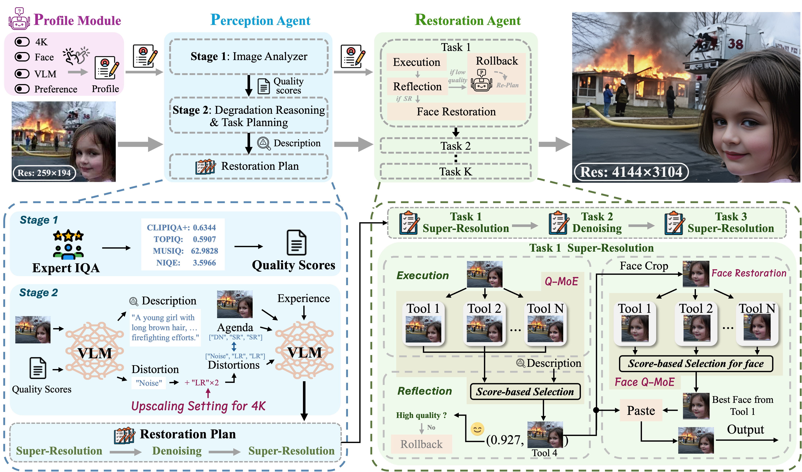

# 4KAgent: Agentic Any Image to 4K Super-Resolution

<div align="center">

[](https://4kagent.github.io)&nbsp;
[](https://arxiv.org/abs/2507.07105)&nbsp;
[]()


</div>


<p align="center">
  <a href="https://arxiv.org/abs/2507.07105">
    <strong><em>4KAgent: Agentic Any Image to 4K Super-Resolution</em></strong>
  </a>
</p>
<p align="center">
  <strong><em>🚧 Code coming soon. Stay tuned!</em></strong>
</p>


<p align="center">
    
<p>


## Introduction

We present **4KAgent**, an agentic image super-resolution generalist designed to universally upscale any image to **4K resolution**, regardless of input type, degradation level, or domain. **4KAgent** offers these key features:

- 🔥 **Framework**: **4KAgent** is the first AI agent framework for universal any-image-to-4K upscaling, capable of handling **all image categories**, ranging from classical and realistic degradations, extreme low-quality inputs, AI-generated imagery, to scientific imaging tasks such as remote sensing, microscopy, and biomedical inputs.

- 🔥 **System Design**: A multi-agent system in **4KAgent**, the **Perception Agent** employs large vision-language models (VLMs) to analyze the content and distortion in the image and provide the restoration plan for the restoration agent to execute. The **Restoration Agent**, which sets up an execution—reflection—rollback procedure for recursive restoration and upscaling.

- 🔥 **Q-MoE & Face Restoration pipeline**: In each restoration step of the restoration plan, we propose a Quality-Driven Mixture-of-Expert (**Q-MoE**) policy in execution and reflection to select the optimal image. We further develop a **face restoration pipeline** to enhance faces in images.

- 🔥 **Profile Module**: To expand the applicability of **4KAgent**, we propose a **Profile Module** to bring the availability to customize the system for different restoration tasks. **4KAgent** can adapt to different restoration tasks without extra training.

- 🔥 **DIV4K-50 Dataset**: We build the **DIV4K-50** dataset as a challenging testset to upscale a low-quality (LQ) image in 256 × 256 resolution with multiple degradations to a high-quality (HQ) 4K image in 4096 × 4096 resolution.


## Pipeline

<p align="center">
    
<p>


## Citation
```
@article{zuo20254kagent,
      title={4KAgent: Agentic Any Image to 4K Super-Resolution}, 
      author={Yushen Zuo and Qi Zheng and Mingyang Wu and Xinrui Jiang and Renjie Li and Jian Wang and Yide Zhang and Gengchen Mai and Lihong V. Wang and James Zou and Xiaoyu Wang and Ming-Hsuan Yang and Zhengzhong Tu},
      year={2025},
      eprint={2507.07105},
      archivePrefix={arXiv},
      primaryClass={cs.CV},
      url={https://arxiv.org/abs/2507.07105}, 
}
```
